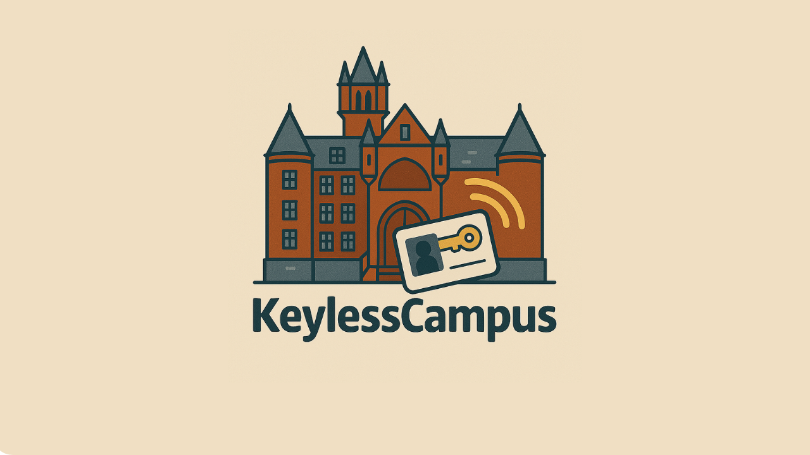

# KeylessCampus

🔒 [Watch Demo Video](https://youtu.be/2A8vxpOp-nk?si=vpI7ShX62BQcpEkt)

---

## 📌 Inspiration
I lost my dorm room keys last week—and I'm definitely not alone. At least **20% of college students in the U.S.** lose their dorm keys each academic year, often having to pay **$100+** to replace locks and keys for themselves and their roommates. 

## 🚪 What It Does
KeylessCampus is a smart door unlocking system for college dorms. It integrates:

- **An RFID scanner** mounted outside each door
- **A smart knob controller** on the inside
- **A web dashboard** to manage user access and view door activity

Users can scan their RFID cards to unlock doors and use the web app to register cards, track access history, and manage permissions for each room system.

## 🛠️ How We Built It

**🔧 Hardware:**
- Two **ESP32** boards running a custom **TCP protocol** on top of **FreeRTOS**
- An **RC522 RFID sensor** reads RFID tags and sends data to the backend
- Verified credentials trigger a **relay-powered DC brushless motor** to unlock the door

**🖥️ Software:**
- **Frontend**: React + Vite
- **Backend**: Java Spring Boot MVC
- **Database**: PostgreSQL hosted on Render
- The web client lets users:
  - Register RFID cards
  - Log in to view access dashboards
  - Manage door access

## 🚧 Challenges We Faced

**Hardware:**
- Developing reliable embedded code for the ESP32 motor control
- Navigating WiFi band incompatibility with ESP32 and setting up stable TCP communication

**Software:**
- Designing an effective and scalable database schema
- Integrating frontend signup with backend RFID registration
- Debugging communication between the chip, server, and UI

**Demoing:**
- Simulating a realistic proof of concept without a real dorm door or a full-strength motor

## 🏆 Accomplishments We're Proud Of
We successfully built and demoed a full hardware + full-stack solution **within 36 hours** at a hackathon—while still managing to enjoy the weekend! This was also our **first ever hardware project**, which makes it all the more rewarding.

## 🎓 What We Learned
We gained valuable experience in:
- Embedded systems and microcontroller programming
- TCP/IP networking protocols
- RFID system integration
- Full-stack architecture, including database design and React/Java Springboot interplay

## 🚀 What's Next for KeylessCampus
The ultimate goal? **Scale KeylessCampus to every college dorm room in the U.S.** Future plans include:

- Building a more compact, production-grade lock unit
- Adding multi-factor authentication and mobile integration
- Expanding access analytics and remote control features

---

💡 *KeylessCampus: Unlock your college experience.*
